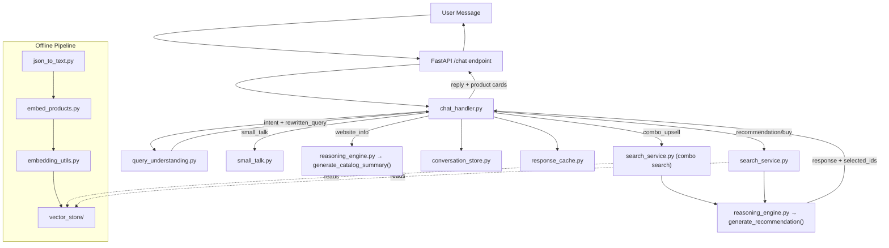

# Millex AI + Recommender System — Dictionary

> Complete reference for the AI chatbot and product recommendation system.
> Last updated: 2026-02-13

---

## Architecture Overview



---

## Data Flow

### 1. Offline: Product Ingestion → Embedding
```
Scraper → data/processed/*.json
                ↓
        json_to_text.py (load + deduplicate + convert to text)
                ↓
        embedding_utils.py (OpenAI text-embedding-3-small)
                ↓
        embed_products.py (FAISS index + metadata)
                ↓
        vector_store/products.index + products_meta.json
```

### 2. Online: User Query → Response
```
User message
    ↓
chat_handler.py
    ↓
query_understanding.py (LLM classifies intent, rewrites query)
    ↓ (intent routing)
    ├── small_talk → small_talk.py → direct LLM response
    ├── website_info → reasoning_engine.py → catalog summary
    ├── combo_upsell → re-search with product_type=combo
    ├── follow-up (no search) → reasoning_engine.py with memory products
    └── recommendation/buy → search_service.py → reasoning_engine.py
                                    ↓
                            FAISS similarity search
                            + keyword boost
                            + category filter
                            + price filter
                            + product_type filter
                                    ↓
                            Top-K products → LLM recommendation
                                    ↓
                            Response + [SELECTED_IDS] → frontend
```

---

## File Reference

### `app/services/ai/` — AI Layer

---

#### `chat_handler.py` — Main Orchestrator
**Purpose**: Routes user messages through the entire pipeline. This is the single entry point for the chatbot.

| Function | Signature | Description |
|---|---|---|
| `handle_user_message` | `(session_id: str, user_input: str) → tuple[str, list]` | Main entry point. Saves message → loads memory → classifies intent → routes to handler → returns (reply, product_list) |

**Intent Routing Logic:**
| Intent | Action |
|---|---|
| `small_talk` | → `small_talk.py` |
| `website_info` | → `reasoning_engine.generate_catalog_summary()` |
| `combo_upsell` | → re-search `last_query` with `product_type=combo` |
| `comparison` / `info` (follow-up) | → `reasoning_engine` with `last_products` from memory |
| `recommendation` / `buy` | → `search_service` → `reasoning_engine` |

---

#### `query_understanding.py` — Intent Classification
**Purpose**: Uses LLM to classify user intent and extract search parameters.

| Function | Signature | Description |
|---|---|---|
| `extract_query_intent` | `(user_message: str, history: list) → dict` | Returns JSON with `intent`, `rewritten_query`, `product_type_filter`, `constraints`, `explicit_category` |

**Valid Intents:** `small_talk`, `recommendation`, `comparison`, `info`, `buy`, `combo_upsell`, `website_info`

**Output Fields:**
- `rewritten_query`: Optimized search string, or `null` for non-search intents
- `product_type_filter`: `"single"` (default), `"combo"`, or `"any"`
- `constraints.budget`, `constraints.category`, `constraints.preferences`
- `explicit_category`: One of `special-offer`, `health-mix`, `ready-to-cook`, `combos`, `infant-food`, or `null`

---

#### `reasoning_engine.py` — LLM Response Generation
**Purpose**: Takes product data + user context and generates formatted recommendations via LLM.

| Function | Signature | Description |
|---|---|---|
| `_extract_weight_in_grams` | `(title: str) → float \| None` | Parses weight from product titles (e.g., "800g" → 800.0) |
| `generate_recommendation` | `(user_message, intent_data, products, history) → tuple[str, list]` | Main recommendation function. Builds product context, sends to LLM, parses `[SELECTED_IDS]` from response |
| `generate_catalog_summary` | `(user_message: str) → str` | Loads ALL products from `products_meta.json`, sends to LLM for a grouped catalog overview |

**Key Prompt Rules:**
- Relevance filter: Only show products matching user's query
- Format: `[Product Name] - [Price]` + 1-2 line description
- Combo upsell footer on single-product responses
- `[SELECTED_IDS: id1, id2]` tag at end for frontend filtering

---

#### `conversation_store.py` — Session Memory
**Purpose**: Persists conversation state per session (file-based JSON).

| Function | Signature | Description |
|---|---|---|
| `load_memory` | `(session_id: str) → dict` | Loads or creates session memory. Auto-resets after 15 min timeout |
| `update_memory` | `(session_id: str, updates: dict)` | Merges updates into session memory and persists to disk |
| `append_message` | `(session_id: str, role: str, content: str)` | Adds message to conversation history (max 20 messages) |

**Memory Schema:**
```json
{
  "budget": null,
  "category": null,
  "product_type": null,
  "preferences": [],
  "intent": null,
  "last_products": [],
  "last_query": null,
  "history": [],
  "last_updated": 1700000000.0
}
```

---

#### `response_cache.py` — Response Deduplication
**Purpose**: Caches LLM responses to avoid re-generating for identical queries within a session.

| Function | Signature | Description |
|---|---|---|
| `_hash_query` | `(session_id, query) → str` | SHA-256 hash of `session_id:query` |
| `get_cached_response` | `(session_id, query) → str \| None` | Returns cached response if within 30-minute TTL |
| `save_cached_response` | `(session_id, query, response)` | Saves response to disk cache |

**Storage**: `ai/response_cache/{hash}.json`

---

#### `small_talk.py` — Casual Conversation
**Purpose**: Handles greetings, thanks, and casual messages.

| Function | Signature | Description |
|---|---|---|
| `generate_small_talk_response` | `(user_message: str) → str` | Direct LLM call with minimal prompt. No product context |

---

### `app/services/recommender_system/` — Search & Embedding Layer

---

#### `search_service.py` — Vector Search Engine
**Purpose**: Performs FAISS-based semantic search with multiple filtering layers.

| Function | Signature | Description |
|---|---|---|
| `load_resources` | `(force: bool) → bool` | Loads/reloads FAISS index + metadata. Auto-detects file changes |
| `resolve_category` | `(query, memory) → str \| None` | Priority: memory category → keyword detection fallback |
| `search_products` | `(query, k, memory, product_type) → list[dict]` | Full search pipeline: embed query → FAISS search → filter → rank → return top-K |

**Filtering Pipeline (in order):**
1. **Product Type Filter**: single vs combo vs any
2. **Category Filter**: Hard filter on explicit categories
3. **Price Filter**: Hard cap at budget + 10%, soft penalty for over-budget
4. **Keyword Boost**: 20% weight for keyword matches in title/category
5. **Final Score**: `0.8 × similarity + 0.2 × keyword_score - price_penalty`

---

#### `embed_products.py` — Embedding Pipeline
**Purpose**: Reads all processed products, generates embeddings, and saves FAISS index.

| Function | Signature | Description |
|---|---|---|
| `generate_product_embeddings` | `() → int` | Full pipeline: load products → embed → normalize → FAISS index → save. Returns product count |

**Output**: `vector_store/products.index` + `vector_store/products_meta.json`

---

#### `embedding_utils.py` — OpenAI Embeddings
**Purpose**: Wrapper around OpenAI's embedding API.

| Function | Signature | Description |
|---|---|---|
| `embed_texts` | `(texts: list[str]) → np.ndarray` | Embeds text via `text-embedding-3-small`. Returns float32 numpy array |

---

#### `json_to_text.py` — Product Data Loader
**Purpose**: Loads processed JSON files and converts products to text for embedding.

| Function | Signature | Description |
|---|---|---|
| `load_all_processed_products` | `() → list[dict]` | Loads ALL JSON files from `data/processed/`, deduplicates by product_id |
| `product_to_text` | `(product: dict) → str` | Converts product dict to searchable text string |
| `get_product_texts` | `() → tuple[list, list]` | Convenience: returns (products, texts) |

**Text Format**: `"Title: {title}. Description: {desc}. Price: {price}. Product Type: {type}. URL: {url}."`

---

#### `keyword_filter.py` — Keyword Extraction
**Purpose**: Simple keyword extraction and category detection.

| Function | Signature | Description |
|---|---|---|
| `extract_keywords` | `(text: str) → list[str]` | Splits text, removes stop words, filters short words |
| `detect_category` | `(text: str) → str \| None` | Matches text against `NAV_CATEGORIES` keywords |

---

#### `category_config.py` — Category Definitions
**Purpose**: Defines category-to-keyword mappings used by `keyword_filter.py`.

| Constant | Description |
|---|---|
| `NAV_CATEGORIES` | Dict mapping category slugs to keyword lists. Categories: `special-offer`, `health-mix`, `ready-to-cook`, `combos`, `infant-food` |

---

## Environment Variables

| Variable | Used By | Description |
|---|---|---|
| `OPENAI_API_KEY` | `embedding_utils.py`, `reasoning_engine.py`, `query_understanding.py`, `small_talk.py` | OpenAI API key |
| `EMBEDDING_MODEL` | `embedding_utils.py` | Defaults to `text-embedding-3-small` |

---

## Key File Paths

| Path | Description |
|---|---|
| `data/processed/*.json` | Scraped and processed product data |
| `recommender_system/vector_store/products.index` | FAISS vector index |
| `recommender_system/vector_store/products_meta.json` | Product metadata (parallel to index) |
| `ai/conversation_memory/{session_id}.json` | Per-session conversation state |
| `ai/response_cache/{hash}.json` | Cached LLM responses |
